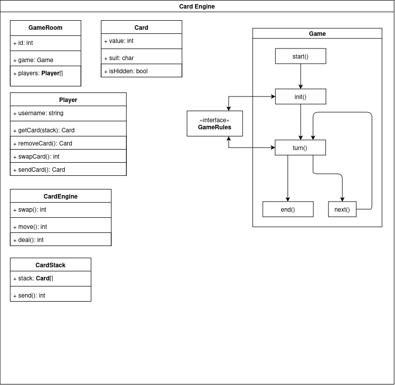

# Card Engine

## Description

An interface for implementing player and card functionality.

## Objects

In order to simulate a card game, we require the following objects:
- CardEngine
- GameRoom
- Game
- Player
- Card
- CardStack

### CardEngine
The CardEngine object has the following definition.
```csharp
class CardEngine {
  int move(Card sourceCard, Cardstack targetStack);
  int swap(Card sourceCard, Card targetCard);
  int deal(CardStack stack);
}
```

### GameRoom
The GameRoom object has the following definition.
```csharp
class GameRoom {
  int id;
  Player[] activePlayers;
  Game game;
}
```

### Game
The Game object has the following definition.
```csharp
class Game {
  int next_turn(function gameRules);
}
```

### Player
The Player object has the following definition.
```csharp
class Player {
  string username;
  int score;
  int getCard(CardStack targetStack);
  int removeCard(Card sourceCard, CardStack targetStack);
  int swapCard(Card sourceCard, Card targetCard);
  int moveCard(Card sourceCard, CardStack targetStack);
}
```

### Card
The Card object has the following definition.
```csharp
class Card {
  int value;
  char suit;
  bool isHidden;
}
```

### CardStack
The CardStack object has the following definition.
```csharp
class CardStack {
  Card[] stack;
  int minimumNumberOfCards;
  int maximumNumberOfCards;
  int take();
}
```

## System Architecture Diagram

A flow diagram representing the architecture of the card engine. 


## Multiplayer Implementation Strategy
Though this card engine will be implemented client side for single player, it will be implemented on the server for
multiplayer in order to ensure that the actions of players are tracked accordingly. For that, a separate system will
need to be implemented so it is adapted for multiplayer connection and synchronised for all connecting clients.
